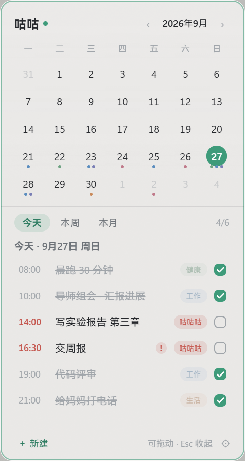
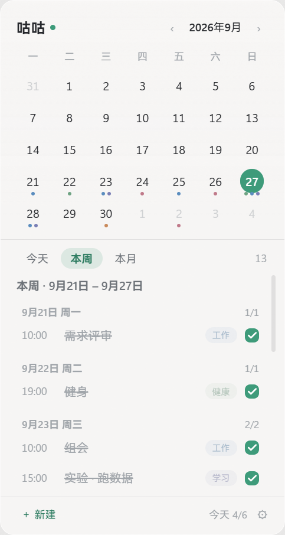
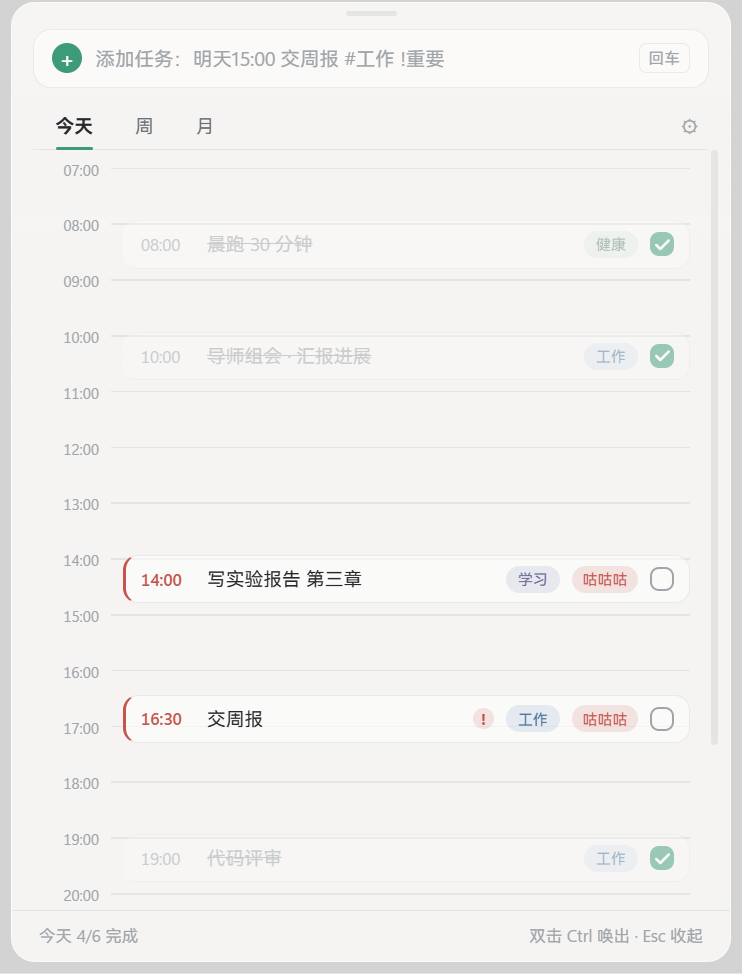
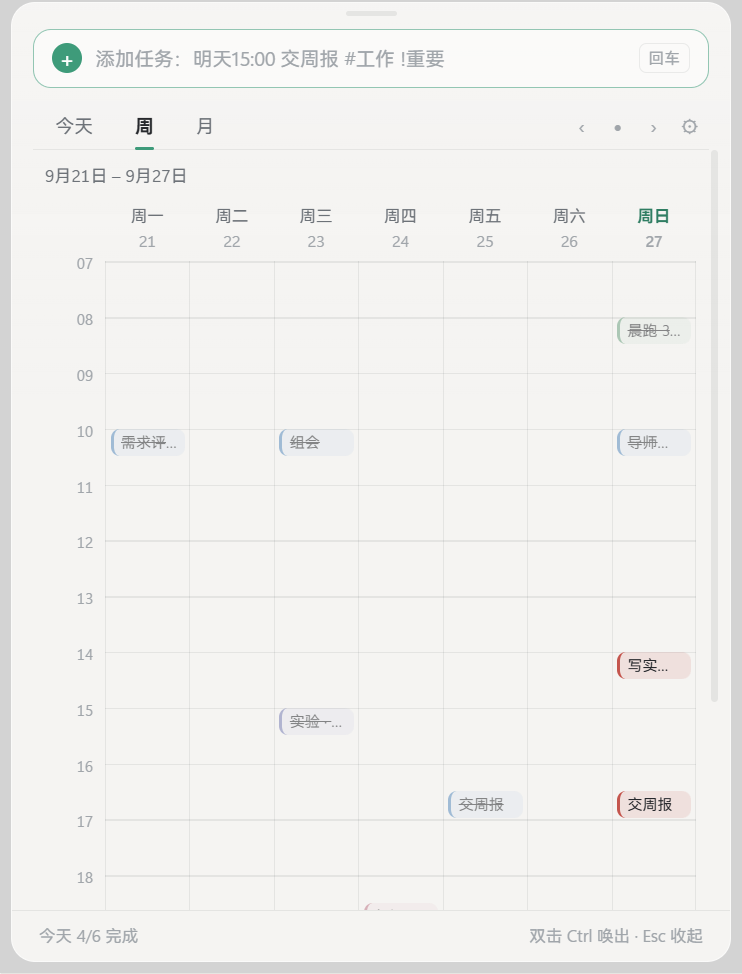
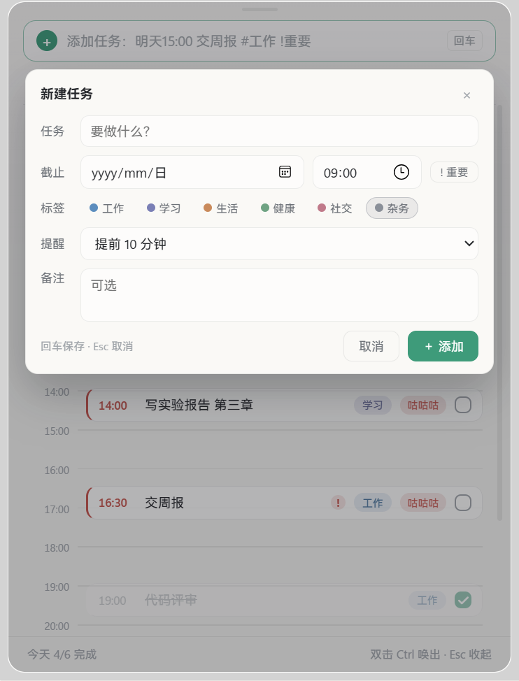

<div align="center">

# 咕咕 · GUGU

**A calendar that lives on your wallpaper — not in your way.**

Summon it with a keystroke, forget about it the rest of the time.

[](#requirements)
[](LICENSE)
[](https://tauri.app)
[](https://vuejs.org)
[](https://www.rust-lang.org)

**English** · [简体中文](README.zh-CN.md)



</div>

---

## Why

Most calendar apps are either a heavyweight window you have to keep open, or a browser tab you never look at. GUGU takes the opposite approach: it lives **on the desktop wallpaper layer, underneath your desktop icons** — always there when you glance at your desktop, never blocking a single click when you don't.

When you actually need to do something with it, press <kbd>Ctrl</kbd><kbd>Ctrl</kbd>. The widget rises above whatever you are looking at and the editing panel opens beside it. When you're done, <kbd>Esc</kbd> puts everything back.

No account. No sync. No telemetry. Your data is a SQLite file on your own disk.

## Features

**Desktop widget**
- Pinned to the wallpaper layer, *below* the desktop icons — visible, never in the way
- Clickable dates, inline checkboxes, drag it anywhere
- Three scopes: **Today**, **This week** (grouped by day), **This month**
- Optional *float above icons* mode, if you'd rather keep it in plain sight

**Summon panel** — <kbd>Ctrl</kbd><kbd>Ctrl</kbd>
- Today view: vertical time axis with a live "now" line; overdue tasks marked and sorted to the top
- Week view: 7-column time grid
- Month view: full month grid with per-category dots and a day list
- Rises above the current window **without** becoming a permanently-on-top window — switch to another app and it gets covered like anything else

**Quick add, in natural language**
- Type `明天15:00 交周报 #工作 !重要` and it is parsed live into date / time / category / priority chips before you commit
- Understands `今天 明天 后天 周五 下周三 9月30日`, `15:00 / 15点 / 下午3点 / 晚上8点`, `#标签`, `!重要`, `每天 / 每周一`

**Reminders**
- Native Windows toast notifications, fired by a background thread in Rust
- Per-task lead time (10 min / 30 min / 1 hour / 1 day / on time / none)
- Do-not-disturb switch, and automatic silencing while a fullscreen app is running

**Appearance**
- Three palettes: 青瓷绿 Celadon · 天青蓝 Azure · 蜜柑橘 Tangerine
- Light & dark, adjustable opacity, optional frosted glass
- Tray icon showing the next task and its countdown

## Screenshots

| Widget — day | Widget — week |
| :---: | :---: |
|  |  |

| Panel — today timeline | Panel — week grid |
| :---: | :---: |
|  |  |

<div align="center">

</div>

## Usage

| Action | How |
| --- | --- |
| Summon / dismiss the panel | Press <kbd>Ctrl</kbd> twice quickly (within ~420 ms) |
| Dismiss | <kbd>Esc</kbd> |
| Complete a task | Click its checkbox — works directly on the desktop widget |
| Edit a task | Click its row |
| Move the widget | Drag its title bar (while summoned) |
| Switch scope | `今天` / `本周` / `本月` on the widget, `今天` / `周` / `月` in the panel |
| New task | Type in the quick-add box and hit <kbd>Enter</kbd>, or click `＋ 新建` |
| Settings | Tray icon → 设置…, or the ⚙ in the panel |

Hotkey interval, the widget's resting layer, opacity, palette, autostart and data export all live in Settings.

## How it works

Two windows share one frontend bundle, split by `?window=widget|panel`. Everything interesting is in [`src-tauri/src/win.rs`](src-tauri/src/win.rs).

**The widget lives in the desktop's own window layer.** On Windows 11 the desktop is:

```text
Progman
 ├─ SHELLDLL_DefView   ← desktop icons
 └─ WorkerW            ← wallpaper layer
```

Parenting the widget into that `WorkerW` puts it below the icons. Two non-obvious requirements:

- The widely-copied "send `0x052C` to `Progman` to spawn a `WorkerW`" trick is **no longer needed** on current Windows 11 — the wallpaper `WorkerW` already exists as a child of `Progman`. The lookup falls back to the legacy path for older builds.
- A cross-process `SetParent` is **silently ignored** unless the child window is first switched from `WS_POPUP` to `WS_CHILD`. It returns success and does nothing. Verify with `GetParent`, never with the return value.

**Summoning does not mean "always on top".** `SetWindowPos(hwnd, HWND_TOP, …)` from a background process cannot beat the foreground window — the window ends up just underneath it and the user sees nothing. GUGU uses the classic two-step instead: set `HWND_TOPMOST`, then immediately `HWND_NOTOPMOST`. The window lands at the top of the *normal* band: it covers what you're looking at right now, and other apps can still cover it later.

**The hotkey has two independent channels.** A low-level keyboard hook (`WH_KEYBOARD_LL`) alone is not reliable: Windows silently removes hooks whose callback exceeds ~300 ms, and some foreground states never deliver to them at all. So alongside the hook, a thread polls `GetAsyncKeyState` every 25 ms — it survives both problems. A shared trigger with a cooldown de-duplicates the two, and a lone-<kbd>Ctrl</kbd> check (no other key within 800 ms) keeps <kbd>Ctrl</kbd>+<kbd>C</kbd>-style combos from firing it.

**Reminders run in Rust, not in the webview.** The widget spends its life occluded by other windows, and WebView2 throttles timers in occluded windows — a JS reminder would drift or stall. A background thread scans deadlines every 30 s instead.

**Frosted glass needs a fallback.** DWM's acrylic/mica effects only apply to top-level windows, so they do nothing for the widget once it is a child of the desktop. GUGU tries the undocumented `SetWindowCompositionAttribute` (resolved at runtime — it is exported by `user32.dll` but absent from `user32.lib`) and reports the outcome back to the frontend. When it fails, the widget falls back to a near-opaque card rather than staying translucent and unreadable.

## Tech stack

| Layer | Choice |
| --- | --- |
| Shell | Tauri 2 (Rust) — ~5 MB installer, ~40 MB resident |
| Frontend | Vue 3 + TypeScript + Vite, hand-written CSS (no UI framework) |
| Storage | SQLite via `rusqlite`, WAL mode |
| Windows integration | the `windows` crate, plus a little raw FFI |

## Requirements

- Windows 10 / 11 (x64). Renders with the WebView2 runtime, which ships with Windows 11.
- Building from source: [Rust](https://rustup.rs), [Node.js 20+](https://nodejs.org), and the MSVC build tools (`Microsoft.VisualStudio.2022.BuildTools` with the *Desktop development with C++* workload).

## Development

```bash
npm install
npm run tauri dev      # Vite + the app, with hot reload
npm run tauri build    # NSIS installer under src-tauri/target/release/bundle
```

`npm run build` type-checks and builds the frontend on its own. To fill a fresh database with demo tasks:

```bash
python tools/seed-demo.py
```

`tools/` also holds the read-only diagnostic scripts used while developing (window trees, z-order, hit-testing, DPI-aware captures). See [`tools/README.md`](tools/README.md) — **read it before running anything that injects input**, and note `tools/release-stuck-keys.ps1` for the case where an interrupted script leaves a modifier key held down.

### A note on memory

Building a `windows`-crate-heavy dependency tree on a 16 GB machine can exhaust memory and produce wildly misleading errors (`only metadata stub found for rlib dependency core`, `STATUS_STACK_BUFFER_OVERRUN`). If you hit those, limit Cargo's parallelism — it is almost never a broken toolchain:

```toml
# ~/.cargo/config.toml
[build]
jobs = 2
```

## Roadmap

- [ ] Recurring tasks — the schema already stores `RRULE` strings, expansion isn't implemented yet
- [ ] Drag to reschedule in the week view
- [ ] Multi-day / all-day tasks
- [ ] Import (JSON export already works)
- [ ] macOS / Linux — platform-specific code is isolated in `win.rs` behind a small surface

## Contributing

Issues and pull requests are welcome. A few things that make review fast:

- Keep Windows-specific code inside `src-tauri/src/win.rs`.
- Check the widget's real state with the scripts in `tools/` instead of assuming — window layering on Windows has a lot of "returns success, does nothing" behaviour.
- Run `npm run build` and `cargo build` before opening a PR.

## License

[MIT](LICENSE)
